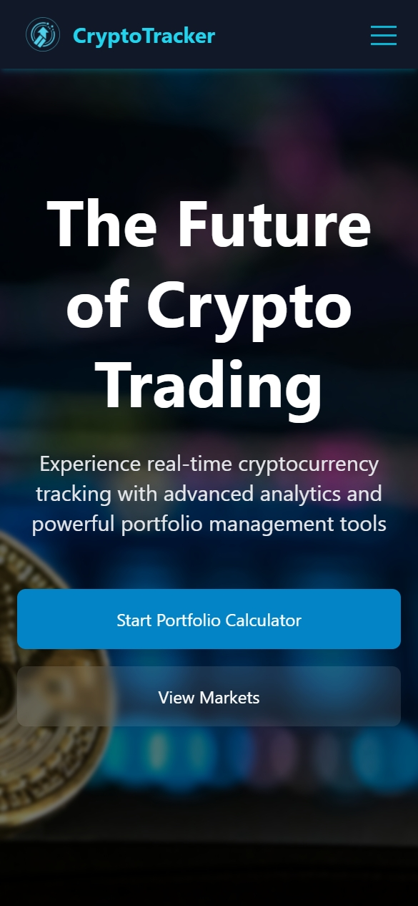
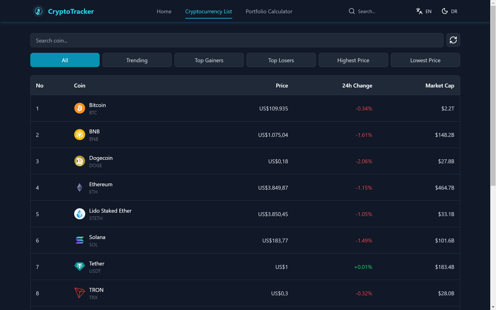
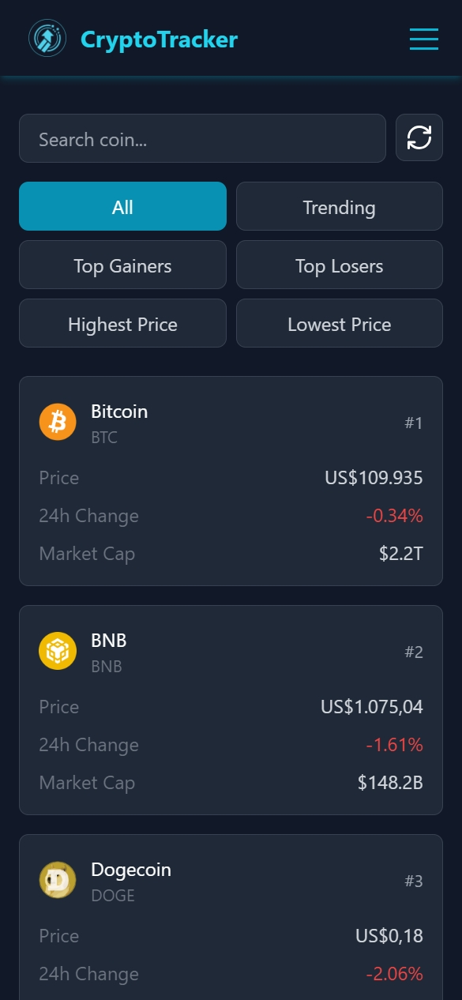
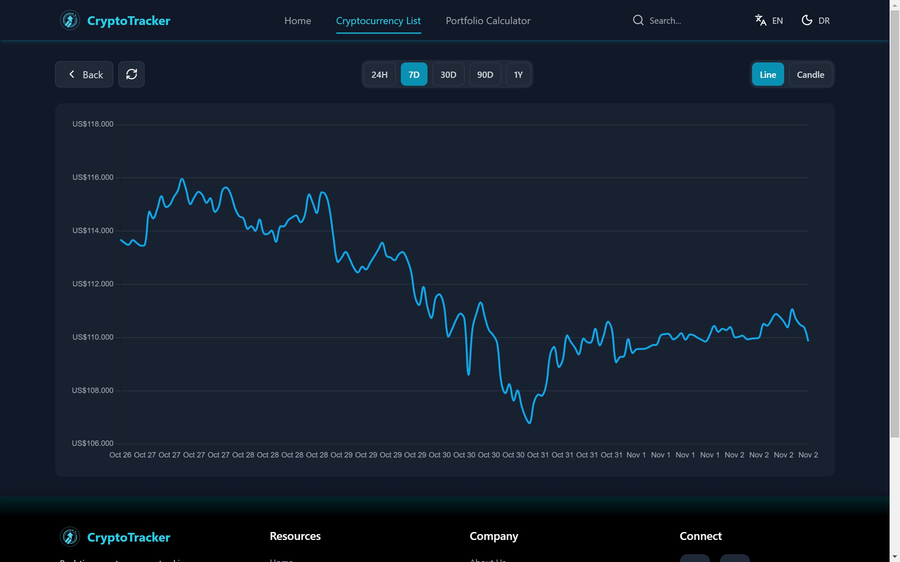
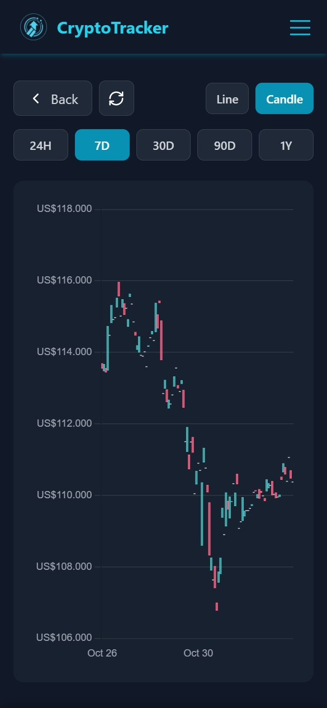
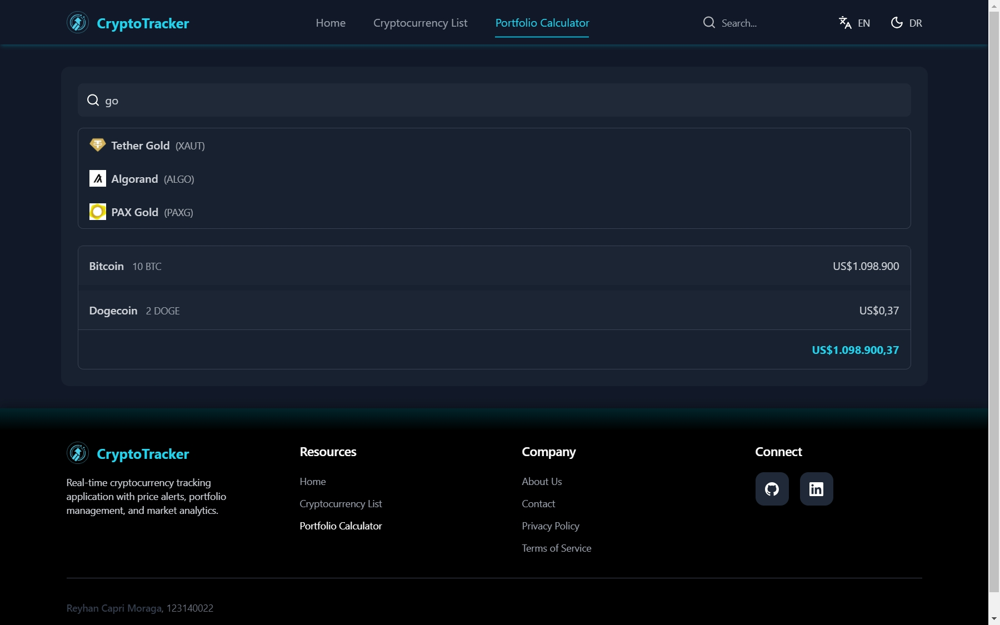
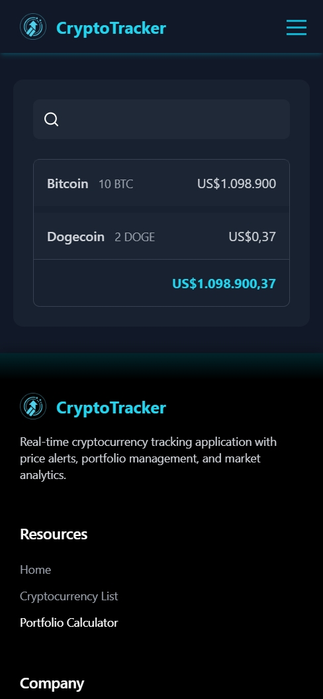
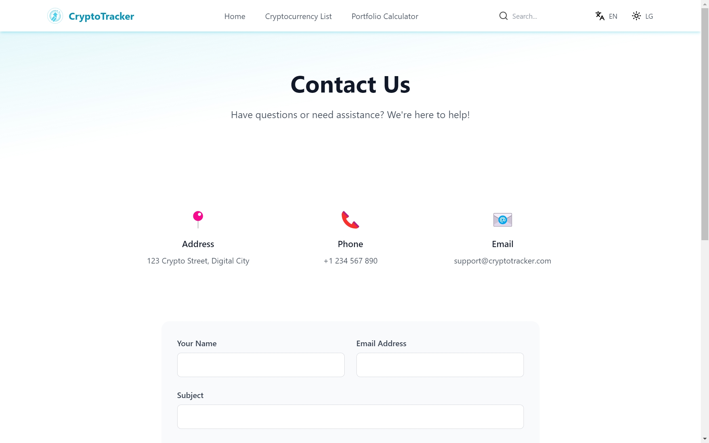
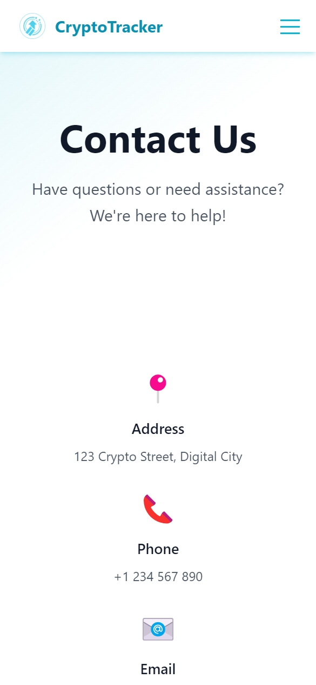

# CryptoTracker 📈

A comprehensive cryptocurrency tracking application built with React, featuring real-time price updates, portfolio management, and advanced charting.


## ✨ Features

### 🏠 Homepage

- Modern, responsive hero section
- Quick access to key features
- Real-time cryptocurrency statistics
- Smooth animations and transitions

|                                  Desktop                                   |                                  Mobile                                  |
| :------------------------------------------------------------------------: | :----------------------------------------------------------------------: |
|  |  |

### 📊 Cryptocurrency List

- Real-time price updates
- Advanced filtering options:
  - Trending coins
  - Top gainers/losers
  - Price-based sorting
- Search functionality
- Responsive table/card views
- Pagination support

|                                     Desktop                                     |                                    Mobile                                     |
| :-----------------------------------------------------------------------------: | :---------------------------------------------------------------------------: |
|  |  |

### 📈 Chart Analysis

- Interactive price charts
- Multiple timeframes (24H, 7D, 30D, 90D, 1Y)
- Chart types:
  - Line chart with area
  - Candlestick chart
- Price and volume indicators
- Responsive design

Features:

- Line and Candlestick charts
- Multiple timeframes
- Price indicators
- Volume analysis

|                               Desktop                                |                               Mobile                               |
| :------------------------------------------------------------------: | :----------------------------------------------------------------: |
|  |  |

### 💼 Portfolio Calculator

- Add/remove coins
- Real-time portfolio valuation
- Holdings breakdown
- Search and add any cryptocurrency
- Persistent storage

|                                   Desktop                                    |                                   Mobile                                   |
| :--------------------------------------------------------------------------: | :------------------------------------------------------------------------: |
|  |  |

### 📱 Mobile Features

- Responsive navigation
- Touch-friendly interface
- Mobile-optimized charts
- Swipe gestures
- Bottom navigation

### 🌐 Internationalization

- Multi-language support (English & Indonesian)
- Currency conversion
- Localized number formatting

### 🎨 Theme Support

- Light/Dark mode
- Persistent theme preference
- Smooth transitions

### 📧 Contact Form

- Desktop
- Mobile

|                                 Desktop                                  |                                 Mobile                                 |
| :----------------------------------------------------------------------: | :--------------------------------------------------------------------: |
|  |  |

## 🚀 Tech Stack

- React 18
- React Router v6
- Tailwind CSS
- Chart.js
- Context API
- Local Storage
- Vercel Deployment

## 🌐 Live Demo
[View Demo](https://uts-pemweb-123140022.vercel.app/)

## 📁 Project Structure

```
.
├── public/                    # Static files
│   ├── data/                 # JSON data files
│   ├── favicon.ico           # Site favicon
│   ├── index.html           # HTML template
│   ├── manifest.json        # PWA manifest
│   └── robots.txt          # SEO robots file
│
├── src/
│   ├── assets/
│   │   ├── icons/          # SVG icons
│   │   │   ├── chevron-down.svg
│   │   │   ├── chevron-left.svg
│   │   │   ├── chevron-right.svg
│   │   │   ├── chevron-up.svg
│   │   │   ├── github.svg
│   │   │   ├── languages.svg
│   │   │   ├── linkedin.svg
│   │   │   ├── moon.svg
│   │   │   ├── refresh-cw.svg
│   │   │   ├── search.svg
│   │   │   └── sun.svg
│   │   └── images/
│   │       ├── logo/
│   │       │   └── CryptoTracker.png
│   │       └── screenshots/
│   │           ├── chart-mobile.jpeg
│   │           ├── contact-desktop.jpeg
│   │           ├── contact-mobile.jpeg
│   │           ├── cryptolist-desktop.jpeg
│   │           ├── cryptolist-mobile.jpeg
│   │           ├── homepage-desktop.jpeg
│   │           ├── homepage-mobile.jpeg
│   │           ├── homepage.jpeg
│   │           └── portfolio-mobile.jpeg
│   │
│   ├── components/          # React components
│   │   ├── charts/         # Chart components
│   │   ├── common/         # Shared components
│   │   ├── layout/         # Layout components
│   │   ├── pages/         # Page components
│   │   └── index.js
│   │
│   ├── context/            # React contexts
│   ├── hooks/             # Custom hooks
│   ├── styles/            # CSS styles
│   ├── utils/             # Utility functions
│   ├── App.jsx           # Root component
│   └── index.js          # Entry point
│
├── .env                   # Environment variables
├── .env.production       # Production env vars
├── .gitignore           # Git ignore rules
├── package.json         # Dependencies
├── postcss.config.js    # PostCSS config
├── README.md           # Documentation
├── tailwind.config.js  # Tailwind config
└── vercel.json        # Vercel deployment
```

